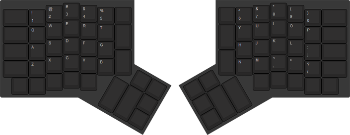
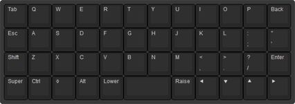

## Les formats

On trouve des claviers de toutes les tailles (et maintenant [de toutes les formes](http://ergodox.io/)), avec un nombre variable de touches. Concernant les tailles, on peut distinguer trois familles :

#### • Le full size
C'est le clavier standard avec pavé numérique et toutes ses touches (105 en Europe, 104 aux US).

&nbsp;

#### • Le TKL ou TenKeyLess
Le même, sans pavé numérique. Il a l'avantage de prendre moins de place sur le bureau et de permettre de moins écarter les bras lors d'un usage avec la souris, notamment lorsqu'on joue, ce qui autorise une posture plus naturelle et moins de fatigue au niveau des épaules.

&nbsp;

#### • Les formats compacts
On appelle généralement clavier compact tout ce qui est moins grand qu'un TKL. 

\- Le **60%** ne comprend que le bloc principal d'un clavier (sans les touches F- ni le bloc directionnel), toutes les touches supprimées se trouvant sur un deuxième *layer*, c'est à dire la plupart du temps accessibles via une combinaison avec Fn. 

&nbsp;

\- Les **75%** sont des 60% avec touches F- et des touches fléchées accolées au bloc principal.

&nbsp;

Il n'y a pas de standard établi concernant ces formats, on trouve donc couramment des variations en fonction des fabricants, par exemple le 65% de plus en plus populaire (aussi large que le 75% mais pas plus haut que le 60%) :

&nbsp;

#### • Les formats ergonomiques 
Très variés, ils abandonnent souvent le décalage latéral (*stagger*) des rangées de touches hérité des claviers de machines à écrire et visent souvent à favoriser une position plus naturelle des mains.

L'Ergodox:

&nbsp;

Le format 40% ortholinéaire :

&nbsp;

Notez que pour les claviers mécaniques, le format choisi ne change rien à la taille des touches ni à leur espacement : si vous prenez un clavier 60% avec switchs MX et le comparez à un full size, vous remarquerez que ses touches ne seront pas plus petites ni plus serrées : il y en a juste moins, et souvent agencées différemment.

Le format détermine donc principalement le nombre de touches que vous aurez à votre disposition et la place que prendra votre clavier sur votre bureau. Pour savoir de quelle façon les caractères sont agencés dessus, il faut s'intéresser à leur disposition, ou *layout*.

&nbsp;

<a href="#top">haut de page</a> | suite : <a href="04-layout.html">Le <i>layout</i> : disposition des touches et des caractères</a>

