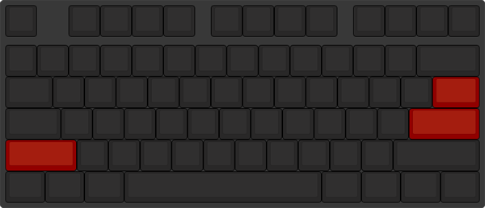
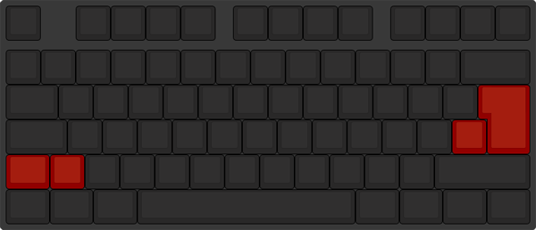
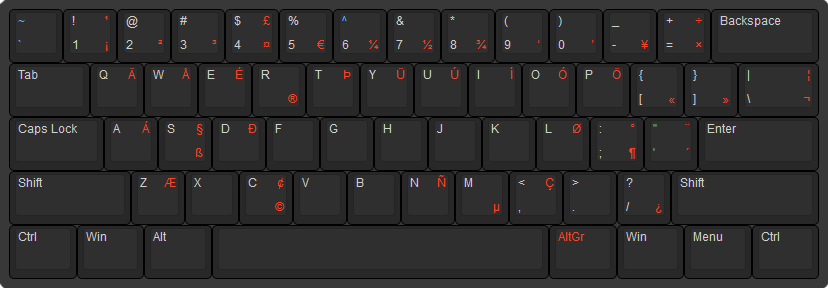

# Le *layout* : disposition des touches et des caractères

Il y a deux façons de décrire la disposition (le *layout*) des touches d'un clavier : la disposition **physique** et la disposition **logique**. Ces deux notions sont complémentaires.

&nbsp;

#### • La disposition physique : ANSI et ISO

La **disposition physique** correspond à la façon dont les touches sont agencées les unes par rapport aux autres, indépendamment des lettres/caractères qui y sont associées. On distingue principalement deux dispositions physiques , l'[**ANSI**](http://fr.wikipedia.org/wiki/American_National_Standards_Institute]) et l'[**ISO**](http://fr.wikipedia.org/wiki/Organisation_internationale_de_normalisation) (on trouve aussi le [**JIS**](http://fr.wikipedia.org/wiki/Japanese_Industrial_Standard]), qui n'est courant qu'au Japon). Voici la façon dont elles sont agencées :

ANSI:

&nbsp;

ISO:

Les différences principales, signalées en rouge, sont les suivantes :

- L'ANSI dispose de **104** touches (en format complet avec pavé numérique, 87 en TKL), l'ISO de **105** touches (88 en TKL).

- Le Shift gauche de l'ANSI (2,25u de large) est réduit à une touche de 1,25u de large pour laisser place à la 105e touche de l'ISO.

- La touche Entrée de l'ANSI est horizontale et surmontée d'une touche plus large (de 1,5u), l'Entrée de l'ISO est verticale et la touche complémentaire (1u) se trouve sur le rang inférieur.

Comme les noms de ces dispositions l'indiquent (cf. liens wiki plus haut), l'ANSI est une disposition trouvée principalement sur les claviers américains, et l'ISO sur les claviers européens.

La dispositions physique étant établie, encore faut-il savoir quel caractère correspond à quelle touche, et c'est là qu'intervient...

&nbsp;

#### • La disposition logique : ne dites plus "azerty" ou "qwerty"

La **disposition logique** correspond à la répartition des caractères sur les touches du clavier : c'est là qu'on parle d'*azerty*, de *qwerty* voire de *qwertz* ou de *qzerty*, mais ces appellations ont le défaut d'être vagues et d'entretenir une certaine confusion : le qwerty US est différent du qwerty UK qui a une touche en plus, l'azerty belge est différent de l'azerty français... Pour éviter cette confusion, il vaut mieux, lorsqu'on parle de la disposition d'un clavier, donner son appellation complète, c'est à dire sa disposition physique et logique : 

- ISO FR pour l'azerty français
- ISO BE pour l'azerty belge
- ISO DE pour le qwertz allemand
- ISO UK pour le qwerty britannique (105 touches)
- ANSI US pour le qwerty américain (104 touches) ou plus simplement ANSI (il n'en existe pas de variantes régionales comme pour l'ISO)

Et ainsi de suite. Pour plus d'infos sur les différentes variantes, cf. [wikipedia](http://en.wikipedia.org/wiki/Keyboard_layout#QWERTY-based_layouts_for_Latin_script).

&nbsp;

#### • Langue et OS

Il est à noter que la disposition physique ou logique d'un clavier ne présume en rien des caractères qu'il peut envoyer à un pc : un clavier n'envoie que des codes de touches (*scancodes*) qui sont ensuite interprétés par l'OS, c'est donc **la disposition choisie dans l'OS** (dans les options régionales/de langue) qui détermine l'association entre touches et caractères. Autrement dit, vous pouvez tout à fait utiliser ce genre de combinaisons :

- un clavier ANSI pour taper en azerty (mais vous perdrez alors la 105e touche, à droite du Shift gauche, le <> sur le clavier français, qu'il vous faudra réassigner de façon logicielle d'une manière ou d'une autre)
- un clavier ISO-FR pour taper en qwerty (anglais ou américain, auquel cas vous aurez une touche en "trop")

![[:arthoung31:2]](https://forum-images.hardware.fr/images/perso/2/arthoung31.gif) Les variantes régionales de l'ISO ne régissent que les caractères **imprimés sur les touches** (les légendes), qui sont purement indicatifs : au niveau matériel, un ISO d'une région est similaire à tout autre ISO et envoie toujours les mêmes codes à l'OS, qui les interprétera différemment selon la langue choisie dans l'OS. 

&nbsp;

#### Un cas particulier : l'US International

Si on peut, comme suggéré ci-dessus, utiliser une disposition azerty avec un clavier ANSI, il existe un layout dédié au format ANSI (104 touches) qui permet d'entrer tout ce dont un habitué de l'ISO FR a besoin, notamment les caractères accentués : c'est la disposition **US International**, à sélectionner dans les paramètres de langue de l'OS. 

Lorsque cette disposition est sélectionnée, les caractères propres au français peuvent être réalisés comme suit :

- '+e ou Alt Gr + e pour avoir é
- `+e pour avoir è
- `+u pour avoir ù
- '+c ou ou Alt Gr + , pour avoir ç
- "+i pour avoir ï
- '+espace pour l'apostrophe

Les caractères en rouge indiquent ce qui obtenu en combinaison avec la touche Alt de droite (AltGr sur un azerty), les caractères en bleu sont des touches mortes qui se combinent avec la lettre suivante (comme le ^ sur la disposition azerty).

Pour les grands habitués de l'azerty, un tel changement d'habitude peut [etre pqrticuli7re;ent frustrqnt. Mais les avantages de cette disposition peuvent valoir la peine de s'y adapter — elle permet notamment de taper Ç, É ou À très facilement, sans besoin de combinaisons du type Alt+0199. Par ailleurs, cette disposition est bien plus propice à l'écriture de code (voyez la position des {[<>]}), et avoir un clavier ANSI vous permettra de profiter d'un maximum de keysets différents, là où l'utilisation de l'ISO complique significativement le remplacement de ses touches (plus de détails dans la section 6).

&nbsp;

<a href="#top">haut de page</a> | suite : <a href="05-comment-choisir.html">Comment choisir un clavier</a>

